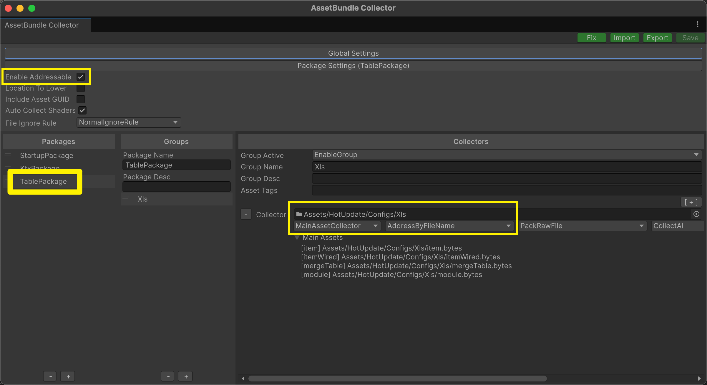

# 🧾 xlsx-fbs / x2f - Excel → FlatBuffers

**xlsx-fbs**（a.k.a. `x2f`）是一个将 Excel 表格批量转换为 [FlatBuffers](https://flatbuffers.dev/) 的命令行工具，支持生成 结构定义 `.fbs` 、表数据`.json` 、 FlatBuffers 二进制 `.bin` 和 多语言数据类（如 `.ts`、`.cs`、`.h` 等）。适用于客户端/服务端通用表格打包场景，支持自定义字段属性、嵌套结构、敏感字段过滤、批量转换等高级玩法。

---

### 🚀 核心功能

- 📄 **支持 .xlsx 表格**，自动识别数据页与属性页  
- 🔧 **自动生成 .fbs 文件**，字段注释、默认值、deprecated 全都安排  
- 🛠️ **集成 flatc**，支持输出 TS / C# / C++ 等多语言代码  
- 🔥 **多线程转换**，适配大规模批量打表需求  
- 🕵️ **敏感字段过滤**，前后端共用表格不用再吵架  
- 🧪 **JSON 生成 & 变更对比**，支持版本控制  
- 🧙 **灵活的字段解析规则**，让你和 Excel 策划都能活下去

---

### 📦 使用方式

> 记得先安装 Node.js，可以用 [VOLTA](https://docs.volta.sh/guide/getting-started)。

```bash
git clone https://github.com/tadazly/xlsx-fbs.git
cd xlsx-fbs

npm install
npm link  # 注册全局命令

# 打单张表
xlsx-fbs item.xlsx --ts --csharp

# 批量打表
xlsx-fbs ./your_folder --cpp --rust -n GameData -k id
```

---

### 🤹 全局指令别名

```bash
xlsx-fbs -h   # 全称
x2f -h        # 简写（同样好用）
```

---

### 📚 配表规范 & 示例

提供详尽的 [配表规范](#数据表-配表规范)，包括字段类型、默认值、属性标注、命名规范等  
自带 `example/` 示例目录，开箱即用，手把手教你上天打表。

---

### 🎒 依赖工具

- `flatc`：FlatBuffers 编译器  
- `xlsx` / `ExcelJS`：表格读取  
- `commander`：命令行解析  
- `chalk`：终端彩色输出  
- `ts-morph`：TS 抽象语法树魔改工具  
- `esbuild`：js 极速打包器  

---

### 🧩 支持平台

- Node.js ≥ 22.12.0  
- 操作系统不限（只要你能跑 Node 和 flatc）


### 🧙 使用建议

- 推荐配合 `$tables.xlsx` [配置文件](#索引表-批量打表配置)进行批量打表管理  
- 别乱删属性页字段，不然后果自负  
- 遇到 FlatBuffers 的坑，看[官方文档](https://flatbuffers.dev/)不是逃避，是自救  

---

> “打表交给我，你只管填坑。” —— 来自一只孤独而强迫症的 Excel 精灵的自白

---


### 👇下面是长篇作文，建议不看。

## 安装 xlsx-fbs 

0. 克隆本项目

    ```shell
    git clone https://github.com/tadazly/xlsx-fbs.git
    cd xlsx-fbs
    ```

1. 初始化项目

    ```shell
    npm install
    ```

2. 链接全局`xlsx-fbs`指令

    ```shell
    npm link
    ```

3. 开始浪，使用 `-h` 查看所有选项

    ```shell
    # 默认
    xlsx-fbs -h

    # 简写
    x2f -h
    ```

- 删除链接的全局指令（不想用的时候再用）

    ```shell
    npm unlink -g
    ```

## 快速上手

看来你已经发现项目中有个 `example` 文件夹。

```
example/
├── singleConvert/       # 打单张表示例
│   └── item.xlsx/        
└── batchConvert/        # 批量打表示例
    ├── 任意目录/           
    └── $tables.xlsx     # 索引表-批量打表配置（可省略）
```

- 打单张表

    ```shell
    # 进入配表所在的文件夹
    cd example/singleConvert

    # 打表
    xlsx-fbs item.xlsx --cpp --rust
    ```

- 批量打表

    ```shell
    # 进入批量打表的根目录
    cd example/batchConvert

    # 批量打表
    xlsx-fbs --ts --csharp
    ```

    根目录有 `$tables.xlsx` 的情况下，只会打索引表中配置了的表。

    接下来可以尝试删除 `$tables.xlsx`，再次执行打表，看看输出有啥区别。


## 说明书

### 1. 创建符合规范的 Excel

#### 简单示例，完整规范请看[配表规范](#数据表-配表规范)

item.xls:

- item: 数据页

    数据页的第一行定义了字段名，与属性页的第一列中定义的字段名对应，顺序可以不同。

    例子：

    A|B|C|D|E
    -|-|-|-|-
    道具id|道具名|描述|最大数|每日上限
    101|豆子|交易东西的基础货币|99999999|100000
    102|钻石|交易稀有物品的货币|99999999|
    1001|HP药|有了他你就能随便浪|9999|99

- property: 属性页

    属性页的 A 列定义 **字段名**，B 列定义了字段的 **变量名**，C 列定义字段的 **类型**，D 列定义字段的 **默认值**（可省略），E 列定义字段的 **属性**（可省略），后面几列随你发挥。

    A|B|C|D|E|F
    -|-|-|-|-|-
    道具id|id|int|||一些功能注释
    道具名|name|string||required|
    描述|desc|string|||
    策划偷偷删掉的|wtf|uint||deprecated|字段就算不用了也最好保留，手动标记废弃
    最大数|max|number|9999||玩家可以拥有的最大数量
    每日上限|dailyLimit|number|||每天最多获得数量限制

- 生成的 .fbs 文件

    ```
    // item.xlsx

    namespace Xlsx;

    table ItemInfo {
      /// 道具id
      id:int;
      /// 道具名
      name:string (required);
      /// 描述
      desc:string;
      /// 策划偷偷删掉的
      wtf:uint (deprecated);
      /// 最大数
      max:uint = 9999;
      /// 每日上限
      daily_limit:uint;
    }

    table Item {
      item_infos:[ItemInfo];
    }

    root_type Item;
    ```

    **注意：**.fbs 中的字段名变成了 `snake_case` 命名，这是其规范，最终代码中的字段名会根据代码规范生成对应的格式，比如 ts 中是 `lowerCamelCase` 而 C# 中是 `UpperCamelCase` 。

### 2. 使用 `xlsx-fbs` 转换

```shell
xlsx-fbs [ input ] [ flatc options ] [ xlsx-fbs options ]
```

#### input 选项

Excel 文件路径或 Excel 所在的文件夹路径，传入文件则转换单张表，传入路径则 **递归** 转换文件夹下的所有表，不传默认转换 `xlsx-fbs` 执行路径下的所有表。 

#### flatc 选项

可转换的代码语言和 **flatc** 的完整参数列表请参考 [FlatBuffers 文档](https://flatbuffers.dev/flatc/)，xlsx-fbs 会将参数传递给 **flatc**。以下列举一些常用的：

- `--cpp --csharp --ts --java` 等，生成对应语言的代码。

#### xlsx-fbs 选项

- `-o, --output <path>` 输出路径，默认输出到执行 `xlsx-fbs` 的文件夹的 `output/` 下。

- `-n, --namespace <name>` 生成代码的命名空间，默认是 `Xlsx`。

- `-k, --default-key <field>` 默认不使用 key 属性，传入后，若表里没有设置 key 属性的字段，则使用该字段作为 key。

- `--binary-extension <ext>` 输出的二进制文件的后缀名，默认输出 bin，你爱发疯可以填 wtf.bytes。

- `--censored-fields <fields>` 删减字段，使用 `,` 连接，会生成一份删减版本的文件到 `output_censored/` 目录。（注意不是删除数据，而是把整个字段从 .fbs 中删除！）

- `--censored-output <path>` 指定删减表的输出路径，默认是 `${output}_censored/`。

- `--output-bin <path>` 拷贝输出的 bin 到指定路径。此类拷贝参数仅批量打表可用，且都会保留原输出路径下的文件。

- `--output-csharp <path>` 拷贝输出的代码到指定路径，以 C# 为例，其他请替换成对应语言名。

- `--censored-output-bin <path>` 拷贝删减版输出的 bin 到指定路径。

- `--censored-output-csharp <path>` 拷贝删减版输出的代码到指定路径，以 C# 为例，其他请替换成对应语言名。

- `--clean-output` 批量打表前，强制清空输出目录，小心使用，不要误删无辜。

- `--empty-string` 表中字符串类型的字段在创建二进制时默认填充空字符串而不是 null。

- `--disable-merge-table`  批量打表时，若在配置表中配置了 `merge` 字段，默认会为这些表生成 `mergeTable` 的代码和二进制，不想要此功能可禁用。

- `--disable-incremental` 批量打表默认开启增量打表，也可以手动关闭。

- `--enable-streaming-read` 开启 .xlsx 格式的流式读取，速度快，内存小，中文可能会乱码😠，还有不稳定出现数据变成 sharedString 的 bug，建议先**不要用**，等 ExcelJS 项目修复。

- `--data-class-suffix <suffix>` 生成的表格数据类名后缀，默认是 `Info`。比如 `item.xlsx` 表生成的每行数据的类名就是 `ItemInfo`；必须避免出现使用类后缀结尾命名的表，比如批量打表时，目录下同时有 `drop.xlsx` 和 `dropInfo.xlsx`，那么第一张表的数据类名会和第二张表的主类名冲突，BOOM💥。

- `--generate-fbs-hash` 在二进制中添加 fbs_hash 值，可用 fbs_hash_table.json 校验数据结构是否匹配。

- `--multi-thread <number>` 批量打表时的多线程数量，默认 6 。

- `--minimal-info` 最小化输出信息，可选范围 `log < info < warn < error`，默认 `info`。

- `--allow-wild-table` 批量打表时允许打野表（$tables.xlsx中未配置的表）。慎用，确保不会把奇怪的东西打出来。

- `--property-order` 自定义属性页顺序，默认 ABCDE。可根据实际表格中列的顺序来定义，例如想直接用表格属性页中 A 列的字段名作为变量名，B列已经定义了类型，并且 C 列被注释占用，那就传入 AABDE，顺序与 **字段名->变量名->类型->默认值->属性** 对应即可。

    >    属性页的默认值：
    >    - A: 数据页的字段名（可随意填写，和属性页做映射关系，并作为生成的 .fbs 中的字段名注释）
    >    - B: 字段对应的变量名（对应 .fbs 中的 field，和代码中的成员字段名）
    >    - C: 字段对应的类型（`short`, `int`, `string` ... 等）
    >    - D: 字段的默认值 （对应 .fbs 中的默认值）
    >    - E: 字段的属性 （对应 .fbs 中的 Attribute）

- `--csharp-unity-loader` 生成 Unity 的表格加载类，数据页需配置 int 类型的 id 字段。

- `--csharp-unity-loader-suffix` 表格加载类后缀，默认 `Table`，要想简短可以用 `s` 。

- `--js` 打包 js。 浏览器用输出的 `.js`, node 用 `.cjs.js` 或 `.esm.js`。 “💩在 JS 里用 FlatBuffers？你是不是疯了？你还好吧？”

- `--js-sourcemap`

- `--js-exclude-flatbuffers` 打包的 js 中移除 flatbuffers 代码，确保在外部正确引入。

- `--js-browser-target <target>` 默认 `es2017`，可以传哪些[自己研究](https://esbuild.github.io/api/#target)，使用 `,` 连接，比如 `--js-browser-target "es2020,chrome58,edge16,firefox57"`

- `--js-node-target <target>` 默认 `node20`。

    > PS: 本项目生成 js 是为脚本构建二进制做准备。 

#### 示例

- 转换单张表：

    ```shell
    xlsx-fbs item.xlsx --cpp --csharp [-o /path/to/output]
    ```

- 批量转换目录下的表，使用 **xls** 作为命名空间， 使用 **id** 字段作为二分查找的 key：

    ```shell
    xlsx-fbs /path/to/xlsx/files --csharp --typescript -n xls -k id [-o /path/to/output]
    ```

### 3. 输出文件

输出的目录结构如下：

```
output[_censored]/
├── fbs/         # 生成的 .fbs 文件
├── bin/         # 生成的二进制文件
├── scripts/     # 生成的代码文件
│   ├── cpp/     # C++ 代码
│   ├── csharp/  # C# 代码
│   └── ts/      # TypeScript 代码
└── json/        # 由二进制文件生成的 json
```

# 附录

## 数据表-配表规范

### 表名规范

- 表名请用英文字符，最好小驼峰（lowerCamel）命名，**不要用** 中文字符、特殊符号 和 Emoji💩。

- 表名会被用来生成类名，所以不要出现任何编程语言相关的保留关键字。

### 数据页规范

- 数据页 Sheet 名称使用 **表名**

- 数据页没有太多限制，字段的顺序可以与属性页不同，只需要字段名和属性页对应、类型符合规范即可。剩下的就让策划背锅。

- 废弃的字段数据页中可以删除该列。

- 为规范表数据结构及避免不必要的问题，尽量使用 `int (int32)` 作为 id 字段类型。 Unity 中数值字段类型也尽量统一使用 `int`。

### 属性页规范

- 属性页 Sheet 名称使用 **property** 或者 **属性**

以下规范基于 FlatBuffers [Schema (.fbs) 规则](https://flatbuffers.dev/evolution/#rules)：

- 属性页定义的字段顺序决定了 .fbs 文件中的字段顺序，所以不能随意更改，也不能随意删除！除非你知道自己在做什么😈

- 新增的字段必须添加在属性页中的最后一行，理由同上。

- 废弃的字段不能删除，乖乖在 **属性** 列填上 `deprecated`。

- 字段名不能使用 `保留关键字`；不能使用 `add` 开头，不能为 `getType`，请避免与代码接口命名冲突。

- 字段名和变量名可以改，你得记得把代码也更新了。

- 字段类型尽量别动，改完老数据可能爆炸。

- 别乱改默认值，一条有用的建议。

PS: 如果能保证上线的代码与数据一致，那你应该知道可以做些什么。

### 类型

字段的 **类型**（ C 列），最好填写 *明确的类型*，如：

#### 字符串 Strings

- `string`

#### 标量 Scalars

- 如 `byte`，`short`，`int`，下面给出具体的表格：

    大小|有符号|无符号|浮点数
    -|-|-|-
    8-bit|byte, bool|ubyte (uint8)|
    16-bit|short (int16)|ushort (uint16)|
    32-bit|int (int32)|uint (uint32)|float (float32)
    64-bit|long (int64)|ulong (uint64)|double (float64)

    **取值范围**：

    8-bit:
    - byte: -128 ~ 127
    - bool: true / false
    - ubyte: 0 ~ 255

    16-bit:
    - short: -32,768 ~ 32,767
    - ushort: 0 ~ 65,535

    32-bit:
    - int: -2,147,483,648 ~ 2,147,483,647
    - uint: 0 ~ 4,294,967,295
    - float: ±1.5×10^-45 ~ ±3.4×10^38

    64-bit:
    - long: -9,223,372,036,854,775,808 ~ 9,223,372,036,854,775,807
    - ulong: 0 ~ 18,446,744,073,709,551,615
    - double: ±5.0×10^-324 ~ ±1.7×10^308

    尽量不要碰 64-bit 的类型，除非你想让数据爆炸。

> 下面是一些比较复杂的类型，枚举（enum）、结构体（struct）和 结构表（子表）（table），建议参考 `example/singleConvert/itemTable.xlsx` 中的用法作为比较。

#### 枚举 Enums

- 使用 `enum@EnumName` 作为类型名称，**必须配置 默认值**。在同名 Sheet 下配置枚举定义：
    
    - 第一列是枚举名，第二列是类型， 第三列是枚举值（可省略）
    - 类型仅支持整形标量 `byte, ubyte, short, ushort, int, uint, long, ulong`
    - 枚举值省略的情况下，默认第一个值为0，后面的值为前一个值加一
    - 枚举一般只增不减，类型也最好不要随意更改

#### 结构体 Structs

- 使用 `struct@StructName` 作为类型名称，用 `{ key: value, key: [value] … }` 这种 json 结构来填写数据，填写时必须按照结构定义，**完整填写数据**。在同名 Sheet 下配置结构定义：
    
    - 第一列是字段名，第二列是类型
    - 类型仅支持标量和定长数组，如 `int, [float] ...`

#### 结构表/子表 Tables

- 使用 `table@SubTableName` 作为类型名称，配法和和上面的数据页、属性页规范一致，在数据页中填写结构表中的索引 id。在同名 Sheet 下配置结构定义，在 `property@SubTableName` 中配置属性。

    - 结构表的属性页的顺序固定为 ABCDE, 不可更改。
    - 结构表必须有 **id** 字段，用于在数据页索引。

#### 向量 Vectors

- 任何以上类型的向量（用 `[type]` 表示），向量中元素的数量任意。

    - 向量长度任意，用逗号分隔。如 `6,6,6`
    - 结构表向量 `[table@SubTable]`，请填写结构表中对应的索引id。如 `1,2,3,4,5`
    - 结构体向量 `[struct@TestStruct]`，请完整填写结构体数据，用逗号分隔。如 `{x:3, y:2, z:1,v:[1,3,4]},{x:1,y:1,z:1,v:[1,2,3]}`

> #### 关于类型推导
>
> 对于字段的值是 **数值**，当使用 *不明确的类型* `number` 时，由程序判断 **标量** 类型。枚举、结构体 **不支持**自动类型推导。
>


#### 默认值

字段的 **默认值**（ D 列），如果不填，默认标量类型是 `0`，其他类型是 `null`。

**重要：** 只有 **标量** 和 **枚举** 能设置默认值，你猜是为什么。

#### 属性

字段的 **属性**（ E 列），请参考[官方文档](https://flatbuffers.dev/schema/#attributes)，如果填了会补充在 .fbs 文件中字段的右边，一般用的上的就 `deprecated` 和 `required`。常见的如下：

属性|用途
-|-
deprecated|废弃字段
required|必填字段，非标量使用，没有数据就报错
key|向量中排序和查找的关键字字段
id|自定义字段编号（用于版本兼容）
force_align|强制对齐
bit_flags|枚举值可组合

## uint64/int64 精度问题

在表格中存储诸如 9007199254740993 的数字时会丢失精度，可以将单元格设置为文本以保留精度。

## 索引表-批量打表配置

批量打表时，在传入的路径放置 `$tables.xlsx` 可用于配置，哪些表要打和一些指定的行为。

索引表的结构和数据表一样，但是配置以下这些 **功能字段**。

- **tableName**: 需要打表的表名，是文件名不需要后缀，若不配置将不会打表。
- **merge**: 是否合并到一张大表中，方便预加载，标记的表会被合并到 `mergeTable` 中。
- **censoredTable**: 敏感表，将不会输出到 `output_censored/` 目录中，但是会输出到 `output/` 中。一般用于前后端共用一套打表逻辑时，从前端目录中删除后端表。
- **censoredFields**: 敏感字段，使用 `,` 连接表中的指定字段（变量名），会删除这些字段后输出到 `output_censored/` 目录中，同时未删减版会输出到 `output/` 中。也是起到将后端使用数据从前端表中移除的作用。
- **constFields**: 常量字段，会使用表中的指定字段作为常量，值类型仅支持`int`或`string`，并转换到独立的 Xlsx.tableNameConst 类中，配置方式为 `[{"key":"","value":"","desc":""},{"key":"","value":"","desc:"""},...]`。例如想使用 **NPC名** 作为常量获取到 **NPC的id** 时，可以这样配置 `[{"key":"npcName","value":"id","desc":"npcDesc"}]`。

当没有在批量打表目录中放置 $tables.xlsx 时，会默认打目录下的所有表。

常量定义代码仅实现了 C# 和 TS。

## 关于 output_censored 目录

- 打单张表时，若传入 `--censored-fields <fields>` 时，会同时生成 **删减版** 和 **完整版** 两份输出文件，分别对应在 `output_censored/` 和 `output/` 目录中。

- 批量打表时，若 $tables.xlsx 中配置了 `censoredTable` 或 `censoredFields` 字段，会同时生成 **删减版** 和 **完整版** 两份输出文件，其中标记 `censoredTable` 的表，将 **不会** 输出到 `output_censored/` 目录中，只会输出到 `output/` 中。

- 没有配置 `censoredTable` 或 `censoredFields` 字段，只会输出一份 `output/`。

## Unity Loader 用法

#### Unity 项目依赖

- [YooAsset 2.3.x](https://www.yooasset.com/): 按照官方教程配置。
- [UniTask](https://github.com/Cysharp/UniTask/releases): 通过 UPM 的形式安装到项目中。
- [FlatBuffers](https://github.com/google/flatbuffers/tree/master/net/FlatBuffers): 把 net/FlatBuffers 文件夹下的 .cs 文件复制到项目中。

#### 示例 Unity 项目结构：

```
Asset/
├── HotUpdate/       
│   └── Configs/        
│   │   └── Xls/           # 放置 x2f 生成的二进制     
│   └── Scripts/
│       ├── GameLogic/      # 游戏逻辑
│       └── Xls/           # 放置 x2f 生成的代码
└── Plugins/        
    ├── FlatBuffers/        # 放置 FlatBuffers 库
    └── UniTask/     
```

#### 数据规范

- 必须配置 `id` 字段，用于数据索引，且类型为 `int`。

#### 打表命令

下列命令以 macOS/Linux/WSL 举例，使用反引号 `\` 作为换行符；Windows PowerShell 请使用 \` 作为换行符；CMD 不支持换行符，可以写个 bat 脚本，使用 ^ 换行。

- 增量打表

    ```shell
    x2f ./example/batchConvert \
    -o "/Path/To/Output" \
    --output-bin "/UnityProject/Assets/HotUpdate/Configs/Xls" \ 
    --output-csharp "/UnityProject/Assets/HotUpdate/Scripts" \
    -n Xls \
    --binary-extension bytes \ 
    --data-class-suffix DataInfo \
    --csharp \
    --csharp-unity-loader
    ```

- 全量打表

    ```shell
    x2f ./example/batchConvert \
    -o "/Path/To/Output" \
    --output-bin "/UnityProject/Assets/HotUpdate/Configs/Xls" \ 
    --output-csharp "/UnityProject/Assets/HotUpdate/Scripts" \
    -n Xls \
    --binary-extension bytes \ 
    --data-class-suffix DataInfo \
    --csharp \
    --csharp-unity-loader \
    --disable-incremental
    ```

#### 使用 YooAsset 打包二进制

创建一个名为 `TablePackage` 的资源包。

AssetBundle Collector:



- 开启 `Enable Addressable`
- 使用 `AddressByFileName` 寻址模式
- 若想自定义修改 `unityTableLoaderBaseTemplate.cs` 和 `unityMergeTableTemplate.cs` 即可。

#### 示例代码

```csharp
async void Start()
{
    // 使用你自己封装的方法加载 TablePackage
    await AssetLoader.DownloadPackageAsync("TablePackage");

    // 加载单张表表
    await Xls.ItemTable.Instance.LoadAsync();
    await Xls.ModuleTable.Instance.LoadAsync();

    // 通过合并表接口加载 $tables.xlsx 中配置了 merge 字段的表
    await Xls.MergeTableLoader.LoadAllAsync();  
    // 这行和上面两行单独加载 item 和 module 是等价的，具体可以看 MergeTableLoader.cs 中的实现

    // 获取单行数据
    var item = Xls.ItemTable.Instance.Get(101);
    Debug.Log(item.HasValue ? item.Value.Name : "Nope");

    // 获取所有数据
    var items = Xls.ItemTable.Instance.GetAll();
    foreach (var itemDataInfo in items)
    {
        Debug.Log($"id: {itemDataInfo.Id} name: {itemDataInfo.Name}");
    }

    // 获取常量定义指向的数据
    if (Xls.ModuleTable.Instance.TryGet(Xls.ModuleConst.CHAT_PANEL, out var module))
    {
        Debug.Log(module.Name);
    }
    else
    {
        Debug.LogError("Cant find chat panel");
    }

    await Xls.DomainTable.Instance.LoadAsync();
    // 暴露了 FlatBuffers 的 Root 对象，可以用于表中配置的 key 属性获取数据
    var google = Xls.DomainTable.Instance.Root.DomainDataInfosByKey("google");
    Debug.Log(google.HasValue ? google.Value.Ip + google.Value.Port : "Nope");
}
```

#### 关于 Assembly Definition References

- 可以为 `FlatBuffers` 和 `Xls` 创建 asmdef 文件，并在你的项目中添加 `FlatBuffers` 和 `Xls` 的引用。

## 依赖库

### Node.js v22.12.0+

- 没有安装过的朋友，何不试试 [VOLTA](https://docs.volta.sh/guide/getting-started) 进行 node 版本管理。

### FlatBuffer

- **flatc**: FlatBuffers 的官方编译器，专门用来把 .fbs 文件变成一堆你不愿维护的代码。

> 如果仓库里的二进制你跑不动，请参照文档[自行编译](https://flatbuffers.dev/building/)或者下载编译好的[二进制文件](https://github.com/google/flatbuffers/releases)。

### NPM

- [chalk](https://www.npmjs.com/package/chalk): 终端搞颜色。

- [commander](https://www.npmjs.com/package/commander): 命令行语法糖。

- [esbuild](https://github.com/evanw/esbuild): ts编译加打包。

- [ExcelJS](https://www.npmjs.com/package/exceljs): 负责流式处理表格数据（仅支持.xlsx）。

- [p-limit](https://www.npmjs.com/package/p-limit): 限制并发。

- [ts-morph](https://www.npmjs.com/package/ts-morph): 读取ts文件。

- [xlsx](https://www.npmjs.com/package/xlsx): 一口气吃完内存的表格砖家。

## 坑点记录

- flatc 参数，如 --allow-non-utf8，--natural-utf8 只在二进制转 json 时有用，--force-empty 更是一点用都没，需要在构造二进制时自己处理该逻辑。

- 使用 flatc 转换 bin 到 json 时，必须设置 --strict-json，否则就爆炸；-o 参数需要放在输入前，二进制文件要放在 -- 后，没有设置 file_indentifier 时，需要传入 --raw-binary。

- ExcelJS 流式读取较大的中文表格时，会不稳定出现乱码��，还有多个sheet时会不稳定出现 sharedString bug，最终导致 `TypeError: comment.trim is not a function`，真不是我的锅😭，建议暂时不要用流式加载。

- flatc 生成代码文件夹的命名格式会跟随参数顺序改变，比如命名空间为 `Xlsx`，参数为 `--ts --csharp` 时，输出的代码文件夹为 `xlsx`(kebab)，当参数顺序对调时，文件夹为 `Xlsx`(UpperCamel)。